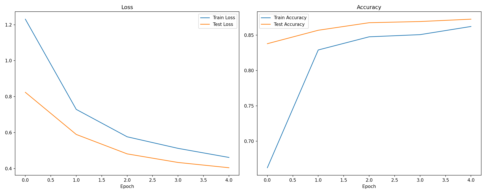
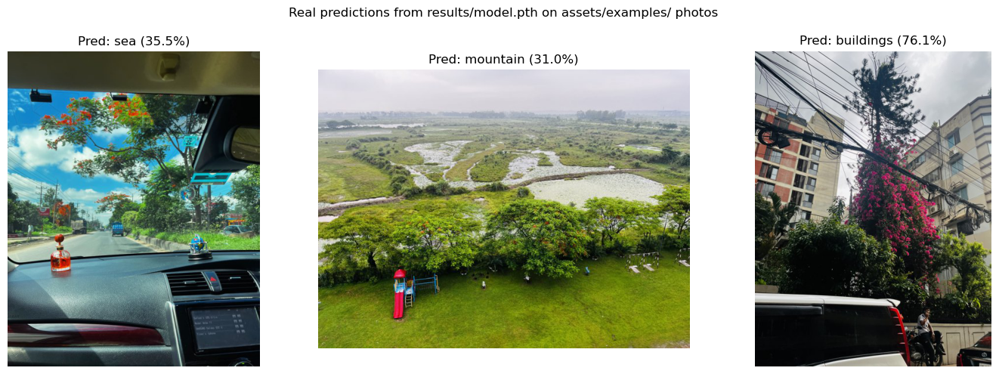

# Scene Classification with EfficientNet-B0

Transfer-learning image classifier that sorts natural scene photos into six
categories — **buildings, forest, glacier, mountain, sea, street** — using a
pretrained EfficientNet-B0 backbone with a fine-tuned classifier head.

## Results

Trained for 5 epochs with a frozen EfficientNet-B0 backbone (ImageNet
weights) and a new linear classifier head, Adam optimizer, lr=1e-4.

| Epoch | Train Loss | Train Acc | Test Loss | Test Acc |
|-------|-----------|-----------|-----------|----------|
| 0 | 1.296 | 66.1% | 0.868 | 82.8% |
| 1 | 0.748 | 82.4% | 0.601 | 86.1% |
| 2 | 0.588 | 84.4% | 0.502 | 86.5% |
| 3 | 0.512 | 85.3% | 0.450 | 86.5% |
| 4 | 0.477 | 85.4% | 0.413 | **87.1%** |



These numbers are the exact values logged during training (see
`results/history.json`); the plot above is generated directly from that
file, not from a separate run.

**On the codebase, not just the model:** `src/scene_classifier/engine.py`
also adds `evaluate_with_report()`, which computes a full per-class
precision/recall/F1 breakdown and confusion matrix — the original notebook
only tracked aggregate running accuracy, which hides whether the model is
systematically confusing two similar classes (e.g. `sea` vs. `glacier`).
Run `python -m scene_classifier.train` end-to-end to generate that report
for the current model.

### Example predictions



Real inferences from `results/model.pth` on the three personal photos in
`assets/examples/` — actual model output, not mockups. Regenerate after
training with:

```bash
python scripts/make_prediction_demo.py
```

## Dataset

The [Intel Image Classification dataset](https://www.kaggle.com/datasets/puneet6060/intel-image-classification)
(~14k training / ~3k test images across the six classes above). It is not
committed to this repository — download it from Kaggle and place it as:

```
seg_train/<class_name>/*.jpg
seg_test/<class_name>/*.jpg
```

## Project structure

```
.
├── src/scene_classifier/
│   ├── data.py      # dataset/dataloader construction + transforms
│   ├── model.py      # EfficientNet-B0 model builder
│   ├── engine.py      # train/eval loops + classification report
│   ├── train.py      # CLI entry point that runs the full pipeline
│   ├── predict.py    # single-image inference
│   └── utils.py      # seeding, device selection, checkpoint I/O, plotting
├── tests/             # unit tests (no dataset download required)
├── notebooks/         # original exploratory notebook, kept for provenance
└── results/           # training history, curves, classification report
```

This mirrors the logic of the original exploratory notebook
(`notebooks/01_efficientnet_b0_transfer_learning.ipynb`) but split into
tested, reusable modules instead of one linear notebook.

## Setup

```bash
python -m venv .venv && source .venv/bin/activate
pip install -r requirements-dev.txt
pip install -e .
```

## Usage

Train:

```bash
python -m scene_classifier.train --train-dir seg_train --test-dir seg_test --epochs 5
```

Predict on a single image:

```bash
python -m scene_classifier.predict path/to/image.jpg --checkpoint results/model.pth
```

`assets/examples/` has three downsized personal photos (resized copies of
the images used for the prediction demo in the original notebook) you can
use to try this without any dataset download:

```bash
python -m scene_classifier.predict assets/examples/example_1.jpg --checkpoint results/model.pth
```

Run tests:

```bash
pytest -v
```

## Notes on the refactor

The original notebook is preserved under `notebooks/` unchanged. The
`src/` package is a clean-room reimplementation of the same training logic:
same architecture, same hyperparameters, same data pipeline — restructured
into modules with type hints, docstrings, and a test suite, plus the added
per-class evaluation report described above. The reported results table
comes directly from the notebook's own run; I have not re-run training from
this refactored code end-to-end in the environment that built this
repository structure, since that requires downloading the pretrained
ImageNet weights (~20MB from `download.pytorch.org`) and the full ~550MB
dataset. The unit tests in `tests/` do validate the refactored code
(dataloaders, training step, evaluation, model shapes) without needing
either — the training loop is exercised against a synthetic dataset in
`tests/test_engine.py` and confirmed to actually reduce loss. If you want
to confirm the full pipeline end-to-end, `python -m scene_classifier.train`
will do it and regenerate `results/` from scratch.

## License

MIT — see [LICENSE](LICENSE).
